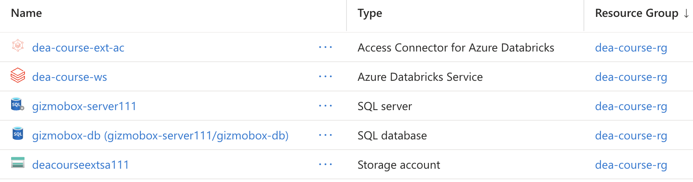

## Databricks Certified Data Engineer Associate – Hands-On Practice Repository

A complete, self-built Databricks workspace for mastering data engineering fundamentals on Azure — including batch/streaming ETL, Delta Lake, Unity Catalog, DLT pipelines, and Databricks SQL dashboards.

This repository documents my practical learning journey for the Databricks Certified Data Engineer Associate (DEA) exam.
It includes notebooks, SQL scripts, and pipeline examples that demonstrate how to design, develop, and optimize data engineering workflows on Azure Databricks.

Each module follows Databricks’ recommended Lakehouse architecture pattern, using Bronze–Silver–Gold data layers, Delta Live Tables, Unity Catalog, and Databricks Jobs to orchestrate end-to-end ELT processes.

### Tech Stack
- **Platform:** Azure Databricks
- **Languages:** Python, SQL
- **Frameworks:** Apache Spark, Delta Lake, Delta Live Tables
- **Tools:** Unity Catalog, Databricks Jobs, DBUtils, Git integration
- **Storage:** Azure Data Lake Storage Gen2

### Repository Structure
| Module | Description |
|--------|--------------|
| `dea01-databricks-lakehouse-platform` | Workspace setup, magic commands, DBUtils, and Git integration |
| `dea02-unity-catalog` | Managing data governance with Unity Catalog, external locations, and permissions |
| `dea03-etl-with-apache-spark` | Batch ETL from JSON/CSV/JDBC sources with transformations and profiling |
| `dea03-etl-with-apache-spark-streaming` | Real-time ingestion using Structured Streaming and Auto Loader |
| `dea04-delta-lake` | Delta transactions, time travel, OPTIMIZE/ZORDER, and VACUUM operations |
| `dea05-delta-live-tables` | Building DLT pipelines with data quality expectations |
| `dea06-databricks-jobs` | Bronze–Silver–Gold pipeline automation via Jobs API |
| `dea07-databricks-sql` | SQL queries, BI dashboards, and data visualization artifacts |
| `dea08-delta-sharing-and-lakehouse-federation` | Cross-platform data sharing and federation scenarios |

### Learning Outcomes
- Built and optimized **ELT pipelines** for structured and streaming data using **Apache Spark**.  
- Practiced **Delta Lake** features: ACID transactions, schema evolution, and performance tuning.  
- Developed **Delta Live Tables (DLT)** pipelines with built-in expectations for data quality.  
- Configured **Unity Catalog** for fine-grained access control and governance.  
- Automated workloads via **Databricks Jobs** and monitored results using dashboards.  

### How to Use
1. Clone the repository to your local machine or import notebooks into your Databricks workspace.  
2. Set up the Azure resources showing as below.
     
4. Run notebooks in sequence to simulate end-to-end ELT processing (Bronze → Silver → Gold).  
5. Optional: connect to Databricks SQL to create dashboards from the curated tables.

### License and credits
- Educational use for personal study

